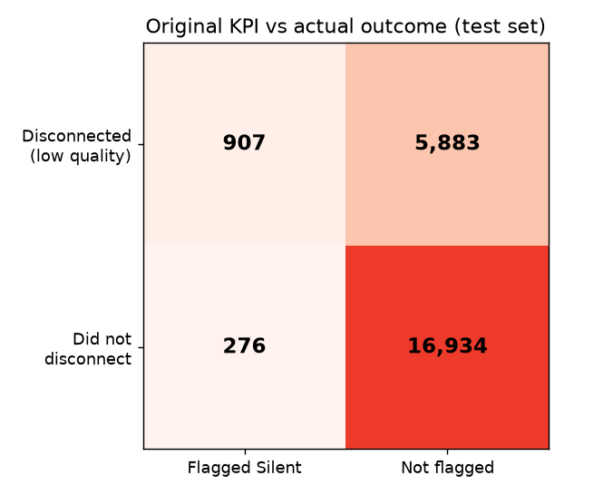
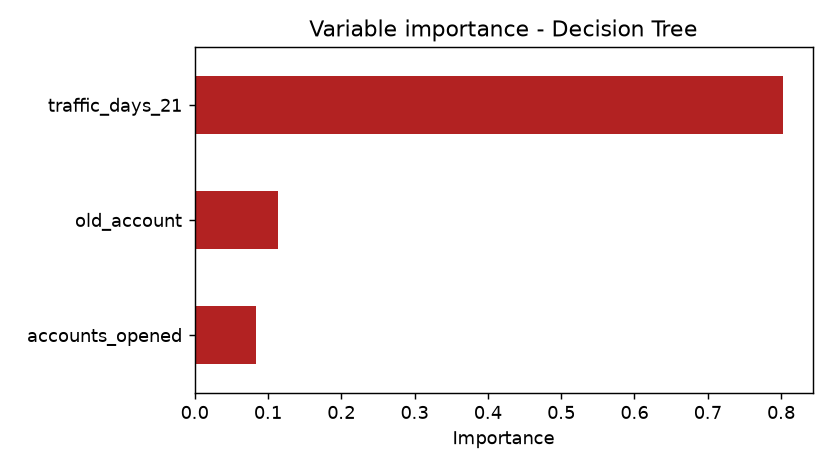
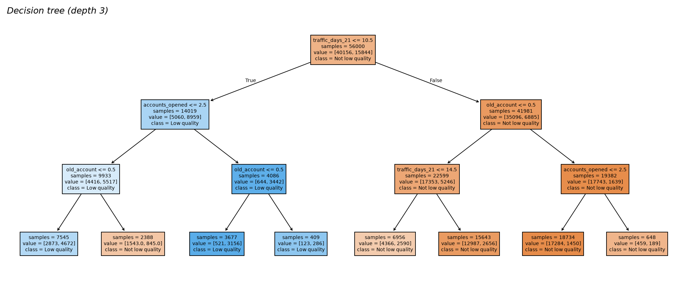
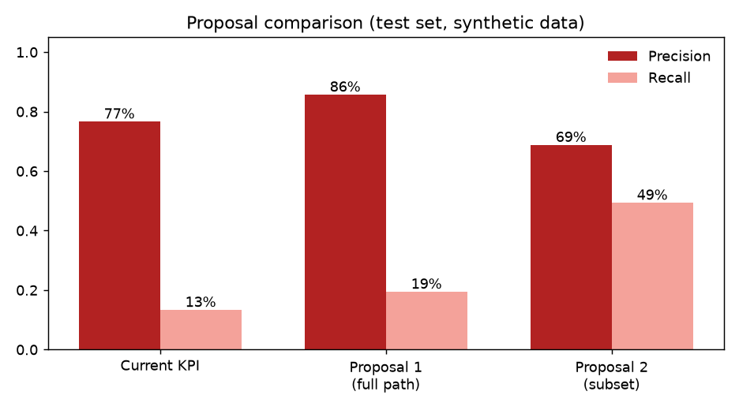

# KPI validation demo (synthetic data)

> **These results come from SYNTHETIC data** generated by `generate_synthetic_data.py`.
> They demonstrate the method (baseline KPI -> decision tree -> rule proposals) and
> were calibrated to behave like the original study (high-precision, low-recall KPI);
> they are **not** the original business results, which are in the main README.

Dataset: 80,000 activations, 28.3% low-quality (disconnected within 6 months).
Train/test split: 70/30, stratified. All metrics below are on the **test set** (24,000 activations).

## 1. Baseline: original KPI (no traffic within 21 days)

| | Value |
|---|---:|
| True positives | 907 |
| False positives | 276 |
| False negatives | 5,883 |
| True negatives | 16,934 |
| **Precision** | **76.7%** |
| **Recall** | **13.4%** |



## 2. Decision tree (depth 3)

Variable importance:

| Variable | Importance |
|---|---:|
| traffic_days_21 | 80.3% |
| old_account | 11.4% |
| accounts_opened | 8.3% |




Tree rules:

```text
|--- traffic_days_21 <= 10.50
|   |--- accounts_opened <= 2.50
|   |   |--- old_account <= 0.50
|   |   |   |--- weights: [2873.00, 4672.00] class: 1
|   |   |--- old_account >  0.50
|   |   |   |--- weights: [1543.00, 845.00] class: 0
|   |--- accounts_opened >  2.50
|   |   |--- old_account <= 0.50
|   |   |   |--- weights: [521.00, 3156.00] class: 1
|   |   |--- old_account >  0.50
|   |   |   |--- weights: [123.00, 286.00] class: 1
|--- traffic_days_21 >  10.50
|   |--- old_account <= 0.50
|   |   |--- traffic_days_21 <= 14.50
|   |   |   |--- weights: [4366.00, 2590.00] class: 0
|   |   |--- traffic_days_21 >  14.50
|   |   |   |--- weights: [12987.00, 2656.00] class: 0
|   |--- old_account >  0.50
|   |   |--- accounts_opened <= 2.50
|   |   |   |--- weights: [17284.00, 1450.00] class: 0
|   |   |--- accounts_opened >  2.50
|   |   |   |--- weights: [459.00, 189.00] class: 0
```

## 3. Rule proposals from the "Silent" branch

* **Proposal 1** (full decision path): `traffic_days_21 <= 10.5 AND accounts_opened > 2.5 AND old_account <= 0.5`
* **Proposal 2** (relaxing `accounts_opened > 2.5`): `traffic_days_21 <= 10.5 AND old_account <= 0.5`

| Definition | Precision | Recall | Flagged |
|---|---:|---:|---:|
| Current KPI | 76.7% | 13.4% | 1,183 |
| Proposal 1 | 85.7% | 19.5% | 1,541 |
| Proposal 2 | 68.8% | 49.4% | 4,870 |



**Reading:** stricter rules give higher precision but lower recall; relaxing a condition
increases coverage at the cost of precision. This is the trade-off the business has to
decide on (for instance, the cost of wrongly decommissioning a line vs the cost of
missing a low-quality sale).
