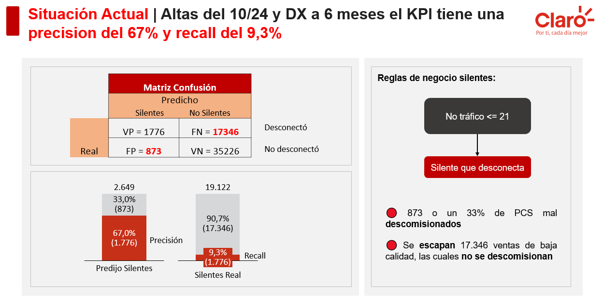
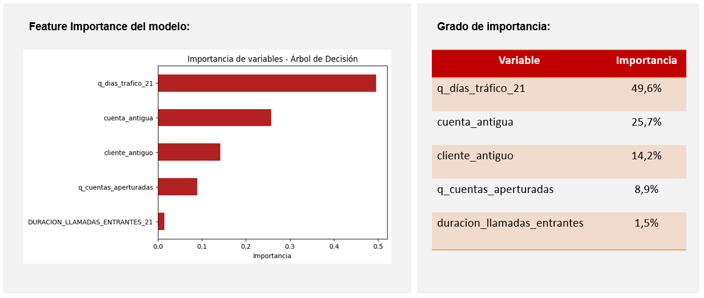
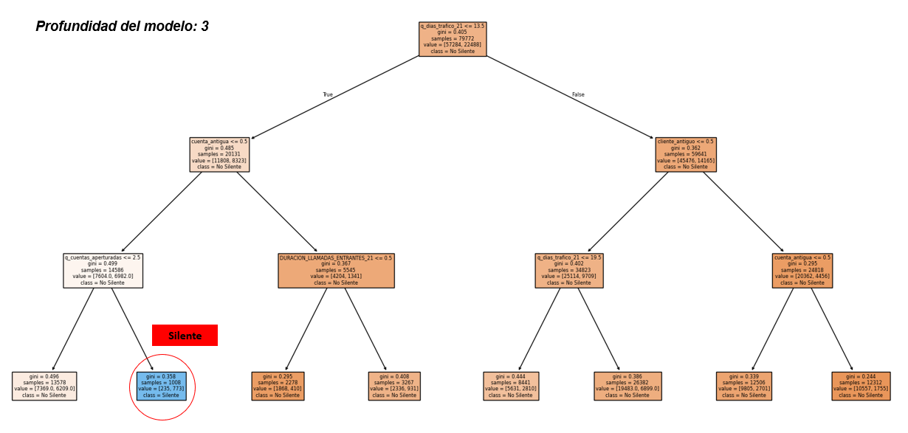
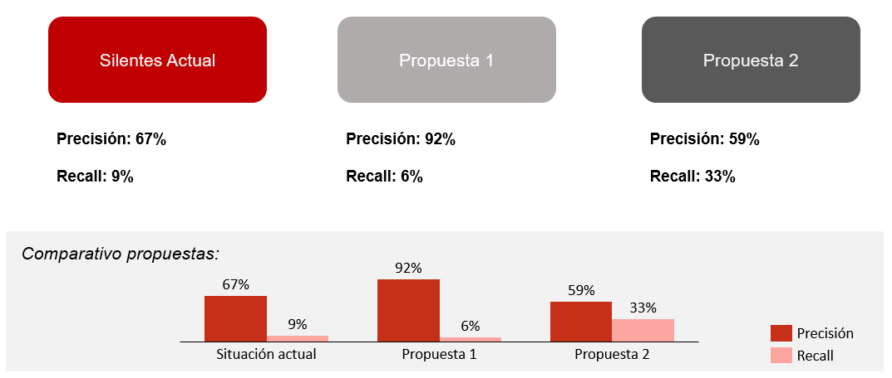

# 📊 Redefinición KPI Silentes – KPI Validity & Behavioral Drift Analysis

Proyecto analítico corporativo desarrollado en la industria de telecomunicaciones, enfocado en la validación y redefinición del KPI de ventas de baja calidad ("Silentes"), utilizando un modelo de clasificación Decision Tree para evaluar la efectividad del indicador y su evolución en el tiempo.

---

## 📌 1. Business Context

El KPI Silentes era utilizado por el área comercial para identificar activaciones sin tráfico de voz ni datos dentro de los primeros días posteriores a la venta, con el objetivo de detectar ventas de baja calidad susceptibles de ser descomisionadas dentro del esquema de comisiones comerciales.

El análisis surge porque el KPI había permanecido sin cambios durante varios años, mientras los patrones comerciales evolucionaban.

> ¿La definición histórica del KPI "Silentes" sigue siendo efectiva para detectar ventas de baja calidad o han cambiado los patrones de comportamiento del cliente?

## 📋 2. Definición del KPI Original

El KPI de “Silentes” fue definido históricamente como:

> Clientes (PCS: números telefónicos) sin tráfico de voz ni datos dentro de los 21 días posteriores a la venta.

Con el tiempo se identificaron riesgos potenciales:

- Los equipos comerciales pueden adaptar su comportamiento a métricas conocidas  
- Las definiciones rígidas de KPI pueden perder capacidad explicativa en el tiempo  
- La relación entre activación y uso real puede evolucionar  

## 📊 3. Current KPI Performance (Baseline)

Este bloque muestra el desempeño del KPI “Silentes” bajo su definición original, utilizado como baseline para evaluar su capacidad de identificación de ventas de baja calidad.

El análisis se basa en la matriz de confusión, la cual compara las predicciones del KPI contra el comportamiento real observado en red.

### 🔢 Confusion Matrix

La siguiente tabla compara las predicciones del KPI con el comportamiento real observado en la red:

| Metric          | Value |
|----------------|------:|
| True Positives | 1776 |
| False Positives| 873 |
| False Negatives| 17346 |
| True Negatives | 35226 |

**¿Qué significa cada caso?**

- **True Positives (1.776):** ventas que el KPI marcó como “silentes” y efectivamente no tuvieron uso de voz ni datos.  
- **False Positives (873):** ventas que el KPI marcó como “silentes”, pero que sí mostraron uso real (errores del KPI).  
- **False Negatives (17.346):** ventas que sí eran de baja calidad, pero el KPI no las detectó.  
- **True Negatives (35.226):** ventas correctamente no marcadas como silentes, ya que sí presentaron uso.

### 📈 Performance Metrics

| Metric     | Value |
|-----------|------:|
| Precision | 67% |
| Recall    | 9.3% |

**Interpretación:**

- El KPI es en un ~67% preciso: cuando marca una venta como de baja calidad, en la mayoría de los casos efectivamente lo es.  

- Sin embargo, su sensibilidad es baja: no logra detectar una gran proporción de las ventas de baja calidad existentes (muchas quedan fuera del KPI).  

- En la práctica, esto significa que el KPI funciona bien como mecanismo de control (evita errores al etiquetar), pero es limitado para capturar completamente el problema de ventas de baja calidad.

### 📉 Visual Overview

<p align="center">
  
</p>

## 🎯 4. Objetivo del Proyecto

- Evaluar la validez del KPI “Silentes”  
- Analizar si las variables base siguen siendo discriminantes  
- Detectar drift en el comportamiento de usuarios  
- Mejorar la interpretabilidad del indicador  

## 🧠 5. Hipótesis de Trabajo

- El KPI sigue siendo válido, pero no necesariamente óptimo  
- El comportamiento de red permite validar su robustez  
- Existen variables adicionales con poder explicativo relevante  
- El comportamiento temprano del cliente es clave para la validación del KPI    

## ⚙️ 6. Data Pipeline / Data Construction

El pipeline tiene como objetivo construir la variable objetivo “Silente”, integrando información de activaciones comerciales con el comportamiento real de uso en red dentro de una ventana temporal definida.

El proceso se estructura en cuatro etapas:

---

### 6.1 Ingesta de activaciones comerciales

Se cargan los registros de ventas (altas), que contienen el identificador del cliente (PCS) y la fecha de activación.

- Fuente principal: sistema de ventas
- Granularidad: una fila por activación
- Variable clave: fecha de alta

Script: `altas_loader.py`

---

### 6.2 Extracción de comportamiento de red

Se extrae desde BigQuery el tráfico de voz y datos asociado a cada cliente.

- Tráfico de voz entrante y saliente
- Tráfico de datos móviles
- Nivel de agregación por día y PCS

Script: `bigquery_queries.sql`

---

### 6.3 Construcción de variables de comportamiento

Se transforma el tráfico en variables analíticas dentro de una ventana de observación post-venta (21 días):

- Presencia de actividad (sí/no)
- Volumen acumulado de tráfico
- Distribución temporal del uso
- Actividad temprana post activación

Script: `traffic_engineering.py`

---

### 6.4 Generación del KPI “Silente”

Se integra la información de ventas y comportamiento de red para construir la variable objetivo:

> Un cliente se clasifica como “Silente” si no presenta tráfico de voz ni datos dentro de los 21 días posteriores a la activación.

Este paso consolida el dataset final utilizado para el análisis y el modelo de validación.

Script: `silentes_pipeline.py`

## 🌲 7. Feature Engineering / Variable Construction

A partir del dataset final construido en el pipeline de tráfico y activaciones, se generan variables diseñadas para evaluar la capacidad explicativa del KPI “Silentes”.

Estas variables combinan señales de comportamiento del cliente junto con definiciones operativas del propio KPI.

El objetivo de esta etapa no es modelar, sino **convertir comportamiento en señales modelables**.

---

### 📊 Features utilizadas en el modelo

| Feature | Description |
|----------|------------|
| silent_21 | No traffic within 21 days |
| silent_15 | No traffic within 15 days |
| silent_10 | No traffic within 10 days |
| silent_5  | No traffic within 5 days |
| traffic_days_21 | Number of days with traffic |
| customer_old | Existing customer flag |
| old_account | Existing billing account |
| accounts_opened | Number of accounts created |
| incoming_calls | Incoming call duration |
| outgoing_calls | Outgoing call duration |
| mobile_data | Data consumption |

---

## 🌲 8. Decision Tree Model – Interpretability & KPI Redesign Analysis

Se entrenó un modelo de **Decision Tree (Árbol de Decisión)** con el objetivo de evaluar si la definición del KPI “Silentes” puede ser explicada y refinada a partir de variables observadas en el comportamiento del cliente.

A diferencia de modelos de tipo *black-box* (Random Forest, XGBoost), este enfoque prioriza la **interpretabilidad**, permitiendo derivar reglas directamente utilizables para el rediseño del KPI.

El modelo se utiliza como una herramienta de extracción de patrones de comportamiento, no como un clasificador predictivo.

---

### 🎯 Objetivo del modelo

- Identificar variables con mayor poder explicativo del comportamiento del cliente  
- Evaluar la coherencia del KPI “Silentes” con señales observadas en los datos  
- Derivar reglas simples basadas en comportamiento real  
- Proponer alternativas de definición del KPI basadas en evidencia  

---

## 🔝 Variables más relevantes del modelo

El análisis de **feature importance** se utiliza como una etapa de pre-priorización de variables, permitiendo identificar las señales más relevantes antes de la construcción del árbol de decisión.

| Variable | Importancia |
|----------|------------:|
| q_días_tráfico_21 | 49.6% |
| cuenta_antigua | 25.7% |
| cliente_antiguo | 14.2% |
| q_cuentas_aperturadas | 8.9% |
| duración_llamadas_entrantes | 1.5% |

---

### 📊 Feature Importance (Pre-Model Prioritization Layer)

Esta visualización muestra la contribución relativa de cada variable en la explicación del comportamiento del cliente.

<p align="center">
  
</p>

---

### 🌿 Decision Tree (estructura de reglas)

Con base en las variables priorizadas, se entrena el modelo de árbol de decisión para extraer estructuras de decisión interpretables.

<p align="center">
  
</p>

---

## 🧩 Decision Path – “Silente” Segment (Tree Branch Analysis)

El modelo permite identificar una ruta específica dentro del árbol de decisión que define el comportamiento “Silente”.

Esta ruta corresponde a una combinación de condiciones que se cumplen de forma simultánea en una misma rama del árbol.

### 🌿 Rama “Silente”

- Si `días_tráfico_21 <= 13.5`  
- Y `cuenta_facturación_antigua = 0`  
- Y `cuentas_aperturadas >= 2.5`  

→ Cliente clasificado como **“Silente”**

---

### 📌 Interpretación de la rama

Esta combinación describe un perfil consistente de baja adopción del servicio:

- Bajo uso reciente del servicio  
- Relación comercial nueva  
- Alta apertura de cuentas en el mismo periodo  

🟠 Este patrón sugiere clientes con baja adopción inicial y potencial comportamiento no sostenible.

---

### ⚠️ Nota metodológica

La interpretación se basa en una **ruta específica del árbol de decisión (decision path)**, no en reglas independientes aisladas.

---

## 📊 Evaluación de reglas propuestas (KPI redesign)

A partir de los patrones identificados en el árbol de decisión, se proponen distintas definiciones operativas del KPI “Silentes”, basadas en diferentes niveles de simplificación del mismo decision path.

| Definición | Regla | Precision | Recall |
|------------|-------|----------:|-------:|
| Actual | Regla original del negocio | 67% | 9% |
| Propuesta 1 | Decision path completo del árbol | 91.5% | 6.2% |
| Propuesta 2 | Subset del decision path (sin cuentas aperturadas) | 58.9% | 33% |

---

### 📌 Diferencia entre las propuestas

- **Propuesta 1 (decision path completo):**  
  Incluye todas las condiciones identificadas en la rama “Silente”, representando la definición más estricta del modelo.

- **Propuesta 2 (subset del decision path):**  
  Mantiene las dos primeras condiciones del path, relajando el criterio de cuentas aperturadas para aumentar cobertura.

Esto genera un comportamiento típico de trade-off:

- Mayor precisión → reglas más estrictas (Propuesta 1)  
- Mayor recall → reglas más amplias (Propuesta 2)  

<p align="center">  </p>
---

## 🧠 Conclusión

El modelo confirma que el KPI “Silentes” no es arbitrario, sino que responde a patrones consistentes observables en el comportamiento del cliente.

Sin embargo, su definición actual puede ser optimizada, ya que distintas configuraciones del mismo decision path generan mejoras significativas en la calidad operativa del indicador, habilitando su redefinición basada en evidencia estructurada del comportamiento del cliente.

---

## 🛠️ Tech Stack

- Python (Pandas, NumPy)
- Google BigQuery
- SQL
- Google Cloud Platform (GCP)
- Jupyter Notebook
- Machine Learning (Decision Tree)
- Data Analysis / KPI Design

---

## 📁 Repository Structure

```text
README.md
│
├── 1. Business Context
│
├── 2. Current KPI Performance
│
├── 3. End-to-End Pipeline
│
├── 4. Machine Learning Validation
│
├── 5. Results
│
├── 6. Repository Structure
│
└── Código
