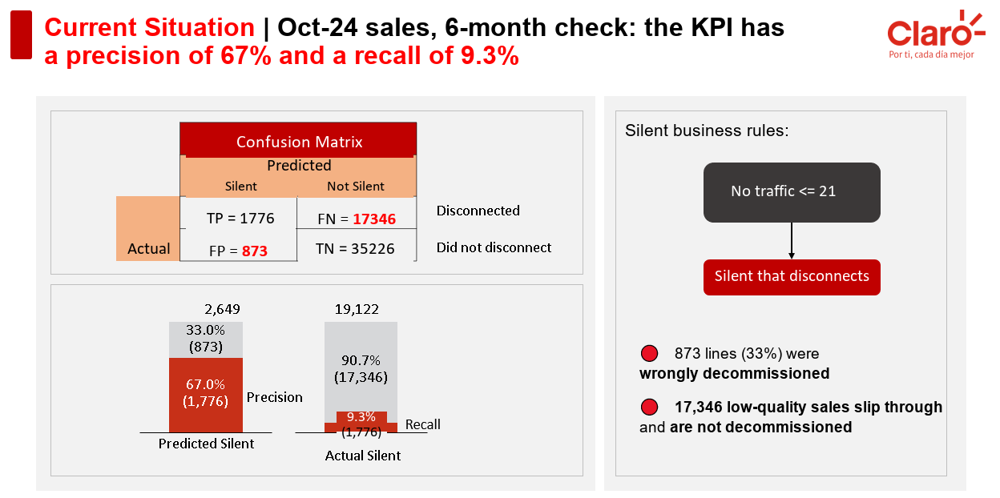
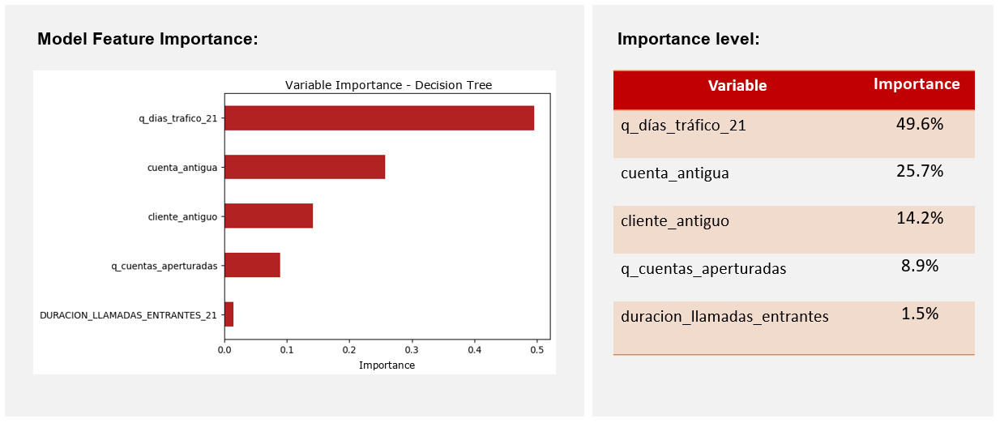
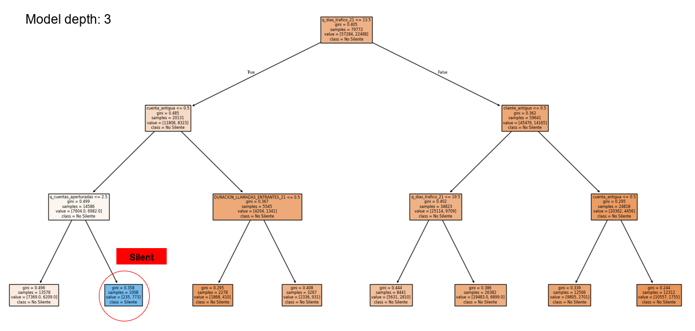
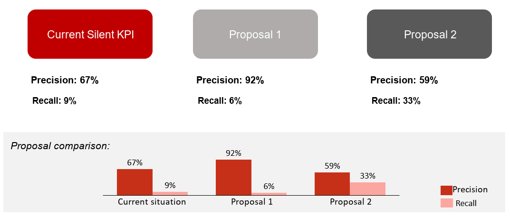

# Silent-Sales KPI Redesign: KPI Validity & Behavioral Drift Analysis

Corporate analytics project developed in the **telecommunications** industry (Claro Chile). It validates and redefines the **low-quality sales KPI ("Silentes", i.e. silent activations)** using a **Decision Tree classifier** to assess how effective the indicator is and how it evolved over time.

> **Language note:** the figures in `4.Outputs/` have English titles and labels. Variable names and class labels inside them (for example `cuenta_antigua`, `No Silente`) and some names in the code (`silente`, `altas`) stay in Spanish, the business language of the original deliverable. The documentation is in English.

---

## 1. Business context

The Commercial area used the **Silentes** KPI to identify activations with **no voice or data traffic in the first days after the sale**, in order to detect low-quality sales that can be *decommissioned* (commission clawback) under the sales-commission scheme.

The analysis was triggered because the KPI had **remained unchanged for several years** while commercial patterns evolved.

> Is the historical definition of the "Silentes" KPI still effective at detecting low-quality sales, or have customer behaviour patterns changed?

## 2. Original KPI definition

> A customer line (PCS: phone number) with **no voice or data traffic within the 21 days after the sale**.

Over time, several risks were identified:

- sales teams can adapt their behaviour to known metrics,
- rigid KPI definitions can lose explanatory power over time,
- the relationship between activation and real usage can evolve.

## 3. Current KPI performance (baseline)

This section shows how the KPI performs under its original definition, used as the baseline. The analysis is based on the **confusion matrix**, which compares the KPI's predictions with the behaviour actually observed on the network.

### Confusion matrix

| Metric           | Value  |
|------------------|-------:|
| True Positives   |  1,776 |
| False Positives  |    873 |
| False Negatives  | 17,346 |
| True Negatives   | 35,226 |

- **True positives (1,776):** sales flagged as silent that indeed had no voice or data usage.
- **False positives (873):** sales flagged as silent that did show real usage (KPI errors, i.e. lines wrongly decommissioned).
- **False negatives (17,346):** low-quality sales that the KPI did not detect.
- **True negatives (35,226):** sales correctly not flagged because they did have usage.

### Performance metrics

| Metric    | Value |
|-----------|------:|
| Precision | 67%   |
| Recall    | 9.3%  |

**Interpretation:**

- The KPI is ~67% precise: when it flags a sale as low quality, it is usually right.
- Its sensitivity is low: it misses a large share of the existing low-quality sales.
- In practice the KPI works as a *control mechanism* (it avoids mislabelling) but is limited for capturing the full low-quality-sales problem.

<p align="center">
  
</p>

## 4. Project objective

- Evaluate the validity of the "Silentes" KPI
- Analyse whether the base variables are still discriminating
- Detect drift in user behaviour
- Improve the interpretability of the indicator

## 5. Working hypotheses

- The KPI is still valid, but not necessarily optimal
- Network behaviour allows validating its robustness
- Additional variables with relevant explanatory power exist
- Early customer behaviour is key to validating the KPI

## 6. Data pipeline / data construction

The pipeline builds the target variable "Silent" by integrating commercial activations with real network usage inside a defined time window. It has four stages:

### 6.1 Ingestion of commercial activations
Sales records (*altas*) with the customer identifier (PCS) and the activation date. One row per activation. Script: `altas_loader.py`.

### 6.2 Network behaviour extraction
Voice and mobile-data traffic per customer is extracted from BigQuery (inbound/outbound voice, mobile data, daily aggregation per PCS). Script: `bigquery_queries.sql`.

### 6.3 Behavioural feature construction
Traffic is transformed into analytical variables within a 21-day post-sale window: presence of activity (yes/no), accumulated traffic volume, temporal distribution of usage, early post-activation activity. Script: `traffic_engineering.py`.

### 6.4 Generation of the "Silent" KPI
Sales and network information are combined to build the target: a customer is **Silent** if there is no voice or data traffic in the 21 days after activation. Script: `silentes_pipeline.py`.

## 7. Feature engineering

The goal of this stage is not to model, but to **convert behaviour into modellable signals**.

| Feature | Description |
|----------|------------|
| silent_21 | No traffic within 21 days |
| silent_15 | No traffic within 15 days |
| silent_10 | No traffic within 10 days |
| silent_5  | No traffic within 5 days |
| traffic_days_21 | Number of days with traffic |
| customer_old | Existing customer flag |
| old_account | Existing billing account |
| accounts_opened | Number of accounts created |
| incoming_calls | Incoming call duration |
| outgoing_calls | Outgoing call duration |
| mobile_data | Data consumption |

## 8. Decision Tree model: interpretability and KPI redesign

A **Decision Tree** was trained to evaluate whether the definition of the KPI can be explained and refined from observed customer behaviour. Unlike black-box models (Random Forest, XGBoost), this approach prioritises **interpretability**: the rules can be used directly to redesign the KPI. The model is used as a **pattern-extraction tool**, not as a predictive classifier.

Model goals:

- identify the variables with the most explanatory power,
- check the coherence of the KPI against observed signals,
- derive simple rules based on real behaviour,
- propose evidence-based alternative KPI definitions.

### Most relevant variables

Feature importance is used as a **pre-prioritisation** step before building the tree.

| Variable | Importance |
|----------|-----------:|
| days with traffic in 21 days | 49.6% |
| old billing account | 25.7% |
| existing customer | 14.2% |
| accounts opened | 8.9% |
| incoming call duration | 1.5% |

<p align="center">
  
</p>

### Decision tree (rule structure)

<p align="center">
  
</p>

### Decision path: the "Silent" segment

One specific branch of the tree defines the silent behaviour; its conditions must hold **simultaneously**:

- `days_with_traffic_21 <= 13.5`
- **and** `old_billing_account = 0`
- **and** `accounts_opened >= 2.5`

→ the customer is classified as **Silent**.

This describes a consistent profile of low adoption: low recent usage, a new commercial relationship, and many accounts opened in the same period. It suggests customers with low initial adoption and potentially unsustainable behaviour.

> **Methodological note:** the interpretation is based on a *specific decision path of the tree*, not on isolated independent rules.

## 9. Evaluation of the proposed rules (KPI redesign)

From the patterns found in the tree, alternative operational definitions of the KPI are proposed, based on different levels of simplification of the same decision path.

| Definition | Rule | Precision | Recall |
|------------|------|----------:|-------:|
| Current | Original business rule | 67% | 9% |
| Proposal 1 | Full decision path of the tree | 91.5% | 6.2% |
| Proposal 2 | Subset of the decision path (without accounts opened) | 58.9% | 33% |

- **Proposal 1 (full path):** includes every condition of the "Silent" branch: the strictest definition.
- **Proposal 2 (subset):** keeps the first two conditions and relaxes the accounts-opened criterion to increase coverage.

This is the typical **precision / recall trade-off**: stricter rules give higher precision, broader rules give higher recall.

<p align="center">
  
</p>

## 10. Conclusion

The model confirms that the "Silentes" KPI is **not arbitrary**: it responds to consistent, observable behaviour patterns. However, its current definition can be optimised: different configurations of the same decision path produce significant improvements in the operational quality of the indicator, enabling an evidence-based redefinition.

## 11. Reproducible demo on synthetic data

The production pipeline (sections 6.1-6.4) reads company-internal sales and network data, so it **cannot be run outside the company** and is included as reference. To make the methodology reproducible, the folder [`3.ML_Validation/`](3.ML_Validation) contains a **runnable demo on synthetic data**:

```bash
pip install numpy pandas scikit-learn matplotlib
cd 3.ML_Validation
python generate_synthetic_data.py   # 80,000 synthetic activations (seeded)
python validate_kpi.py              # baseline KPI -> decision tree -> rule proposals
```

It reproduces the same logic as the original study: (1) measure the **original KPI** against the real outcome, (2) train a **depth-3 decision tree** for interpretability, (3) read the "Silent" branch and derive **two rule proposals** (strict = higher precision, relaxed = higher recall), (4) compare them. The full output is in [`3.ML_Validation/report.md`](3.ML_Validation/report.md), with English figures.

> **Important:** the demo numbers (for example 77% precision / 13% recall for the current KPI) come from **synthetic data calibrated to behave like the original study**. They demonstrate the method; they are **not** the business results, which are the ones in sections 3 and 9 (67% / 9% for the current KPI, from the original data).

## Tech stack

- Python (pandas, NumPy)
- Google BigQuery / SQL
- Google Cloud Platform (GCP)
- Machine learning (Decision Tree, scikit-learn)
- Data analysis / KPI design

## Repository structure

```text
├── 1.KPI_Operational_Pipeline/   # end-to-end pipeline entry point
├── 2.Data_Building/              # altas loader, BigQuery queries, traffic feature engineering
├── 3.ML_Validation/              # runnable demo on synthetic data (generator, validation, report, figures)
├── 4.Outputs/                    # result figures (original study)
└── README.md
```
